# 🤖 机器人云平台 (Robot Cloud Platform)

[](http://127.0.0.1:8000)
[](https://python.org)
[](https://ros.org)
[](https://docker.com)
[](LICENSE)

> **一个现代化的端到端机器人云平台，实现云-边-端一体化的数据处理、监控和管理**

## ✨ 平台特性

### 🌟 核心功能
- **🎯 实时数据处理** - 处理机器人遥测、传感器和状态数据
- **📊 Web控制台** - 现代化的Vue.js管理界面，实时监控
- **🔗 ROS2集成** - 无缝连接Gazebo仿真和真实机器人
- **☁️ 云原生架构** - 基于Kubernetes和微服务设计
- **📈 可视化监控** - Prometheus + Grafana监控体系
- **🚀 边缘计算** - 支持边缘部署和本地推理

### 🏗️ 技术架构
- **后端**: Go 1.23 + Gin框架 (微秒级响应)
- **前端**: Vue.js 3 + Tailwind CSS + ECharts
- **数据库**: PostgreSQL + TimescaleDB + Redis  
- **消息队列**: Apache Kafka + NATS
- **容器化**: Docker + Kubernetes
- **机器人**: ROS2 Jazzy + Gazebo仿真

## 🚀 快速开始

### 📋 系统要求
- **操作系统**: Linux (Ubuntu 22.04+) / WSL2
- **内存**: 最少8GB RAM (推荐16GB+)
- **磁盘**: 20GB可用空间
- **软件**: Docker, Go 1.22+

### ⚡ 一键启动

```bash
# 1. 克隆项目
git clone https://github.com/ink-hz/RoboticsPlatform.git
cd RoboticsPlatform

# 2. 启动API服务
cd services/go-api-gateway
go build -o robot-cloud-go ./cmd/server
./robot-cloud-go

# 3. 访问控制台
# 浏览器打开: http://127.0.0.1:8000
```

### 🤖 连接机器人数据

#### 方法1: ROS2仿真 (推荐新手)
```bash
# 启动ROS2测试节点
source /opt/ros/jazzy/setup.bash
python3 scripts/test-ros-connection.py
```

#### 方法2: Gazebo仿真
```bash
# 终端1: 启动TurtleBot3 Gazebo
./scripts/start-turtlebot-gazebo.sh

# 终端2: 启动桥接服务
cd robot/ros-bridge
source /opt/ros/jazzy/setup.bash
python3 gazebo_cloud_bridge.py
```

#### 方法3: 手动发送数据
```bash
curl -X POST http://127.0.0.1:8000/api/v1/robots/my-robot/telemetry \\
  -H "Content-Type: application/json" \\
  -d '{
    "data": {
      "battery": 85.5,
      "position": {"x": 10.2, "y": 5.3, "z": 0},
      "status": "active"
    }
  }'
```

## 📁 项目结构

```
RoboticsPlatform/
├── 🌐 services/           # 微服务层
│   ├── go-api-gateway/    # Go API网关服务 (前端+API)
│   ├── auth/              # 认证服务
│   └── monitoring/        # 监控服务
├── 🤖 robot/             # 机器人接口层  
│   ├── ros-bridge/        # ROS2桥接服务
│   ├── simulators/        # 仿真环境配置
│   └── drivers/           # 硬件驱动
├── ☁️ platform/          # 平台核心
│   ├── cloud-services/    # 云端服务
│   ├── data-pipeline/     # 数据处理管道
│   ├── edge-computing/    # 边缘计算
│   └── robot-connector/   # 机器人连接器
├── 🔧 infrastructure/    # 基础设施
│   ├── kubernetes/        # K8s部署文件
│   ├── monitoring/        # Prometheus配置
│   └── terraform/         # 基础设施代码
├── 🧠 ml-ops/            # 机器学习运维
│   ├── model-registry/    # 模型注册中心
│   ├── training/          # 训练流水线
│   └── serving/           # 模型服务
├── 🌐 frontend/          # Web前端
│   ├── templates/         # Vue.js模板
│   └── static/            # 静态资源
├── 🔗 edge/              # 边缘计算
│   ├── controllers/       # Go边缘控制器
│   └── agents/            # 边缘代理
├── 📜 scripts/           # 工具脚本
├── 📚 docs/              # 文档
└── 🧪 tests/             # 测试
```

## 🎯 功能模块

### 1. 📊 Web控制台
- **实时仪表板**: 机器人状态、系统健康、数据统计
- **机器人管理**: 设备列表、状态监控、电池管理
- **遥测数据**: 传感器数据流、历史查询
- **可视化**: ECharts图表、实时更新

### 2. 🔌 数据接入
- **ROS2集成**: 支持所有标准ROS2消息类型
- **传感器支持**: 激光雷达、摄像头、IMU、里程计
- **协议支持**: HTTP REST API、WebSocket、MQTT
- **数据格式**: JSON、Protocol Buffers、ROS Bag

### 3. 💾 数据存储
- **时序数据**: TimescaleDB存储传感器时序数据
- **结构化数据**: PostgreSQL存储机器人状态和配置
- **对象存储**: MinIO存储图像、点云、模型文件
- **缓存**: Redis缓存热点数据和会话

### 4. 📈 监控体系
- **系统监控**: Prometheus采集指标
- **可视化**: Grafana仪表板
- **日志管理**: Loki日志聚合
- **告警**: AlertManager告警通知

## 🔧 开发指南

### 本地开发环境

```bash
# 安装Go依赖
go mod download

# 安装ROS2依赖 (如需要)
sudo apt install ros-jazzy-desktop

# 启动开发服务
go run cmd/server/main.go

# 运行测试
go test ./...
```

### 🏗️ 构建和部署

```bash
# 构建所有服务镜像
make build

# 部署到Kubernetes
make setup      # 首次设置K3s
make deploy     # 部署平台服务

# 监控和日志
make monitor    # 打开监控面板
make logs       # 查看服务日志
```

### 🧪 测试

```bash
# API测试
curl http://127.0.0.1:8000/health

# 发送测试数据
go run scripts/send-demo-data.go

# ROS2连接测试
python3 scripts/test-ros-connection.py
```

## 📖 文档

| 文档 | 说明 |
|------|------|
| [快速开始](QUICKSTART.md) | 30分钟快速部署指南 |
| [架构设计](docs/ARCHITECTURE.md) | 系统架构和技术选型 |
| [Gazebo集成](docs/GAZEBO_INTEGRATION.md) | ROS2/Gazebo接入指南 |
| [部署指南](docs/DEPLOYMENT_GUIDE.md) | 生产环境部署 |
| [API文档](http://127.0.0.1:8000/docs) | 自动生成的API文档 |

## 🔄 数据流

```mermaid
graph TB
    A[机器人/Gazebo] -->|ROS2| B[桥接服务]
    B -->|HTTP| C[API网关]
    C -->|存储| D[时序数据库]
    C -->|缓存| E[Redis]
    C -->|流处理| F[Kafka]
    G[Web控制台] -->|WebSocket| C
    D -->|查询| G
    E -->|实时数据| G
```



## 📊 性能指标

- **API响应**: **10-80µs** 微秒级响应
- **吞吐量**: **50,000+ RPS** 支持万级机器人并发
- **内存占用**: **<30MB** 轻量级运行
- **启动时间**: **<1秒** 瞬时启动
- **扩展性**: 水平扩展支持千万级数据点

## 🛠️ 故障排除

### 常见问题

**1. API服务无法启动**
```bash
# 检查端口占用
sudo lsof -i :8000

# 重新编译
go build -o robot-cloud-go ./cmd/server
```

**2. ROS2连接失败**
```bash
# 设置ROS2环境
source /opt/ros/jazzy/setup.bash
ros2 topic list
```

**3. 前端页面空白**
```bash
# 检查API连接
curl http://127.0.0.1:8000/api/v1/dashboard/stats
```

### 📞 获取帮助
- 🐛 **Bug报告**: 创建GitHub Issue
- 💬 **讨论**: GitHub Discussions  
- 📧 **联系**: [邮件地址]

## 🗺️ 路线图

### 短期 (1-3个月)
- [ ] 完善机器人状态管理
- [ ] 添加摄像头视频流
- [ ] 实现云端控制命令
- [ ] 性能优化

### 中期 (3-6个月) 
- [ ] 多机器人协同
- [ ] 路径规划可视化
- [ ] AI模型部署
- [ ] 边缘计算优化

### 长期 (6-12个月)
- [ ] 自动驾驶集成
- [ ] 数字孪生
- [ ] 5G通信支持
- [ ] 商业化功能

## 🤝 贡献指南

欢迎贡献代码！请参考以下步骤：

1. Fork 项目
2. 创建特性分支 (`git checkout -b feature/AmazingFeature`)
3. 提交更改 (`git commit -m 'Add some AmazingFeature'`)
4. 推送到分支 (`git push origin feature/AmazingFeature`)
5. 创建 Pull Request

## 📄 许可证

本项目采用 MIT 许可证 - 查看 [LICENSE](LICENSE) 文件了解详情

## 🌟 致谢

感谢以下开源项目：
- [Gin](https://gin-gonic.com/) - 高性能Go Web框架
- [ROS2](https://ros.org/) - 机器人操作系统
- [Vue.js](https://vuejs.org/) - 渐进式JavaScript框架
- [Kubernetes](https://kubernetes.io/) - 容器编排平台

---

<div align="center">

**🎯 构建下一代机器人云平台**

Made with ❤️ by Ink

[⭐ Star](../../stargazers) | [🐛 Report Bug](../../issues) | [💡 Request Feature](../../issues)

</div>